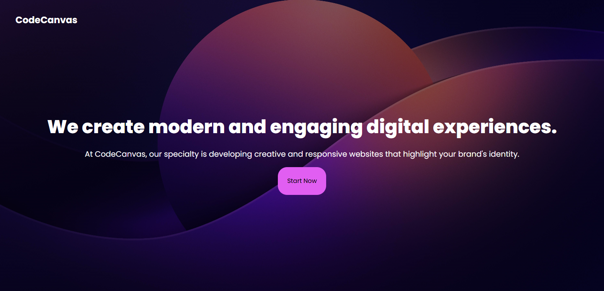

# Description

This project was built using **Next.js**, leveraging its powerful **server-side rendering (SSR)** to deliver fast, **SEO-friendly pages**. The design is fully **responsive**, adapting seamlessly to different screen sizes for a consistent user experience across devices. With a clean and organized layout, the project emphasizes clarity and ease of navigation, providing a modern, efficient browsing experience.

# Main Features
- **Next.js**
- **Tailwind**
- **Responsive Design**

# Screenshots

